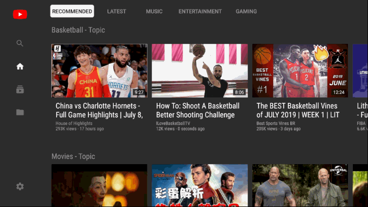
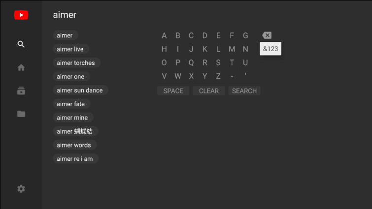
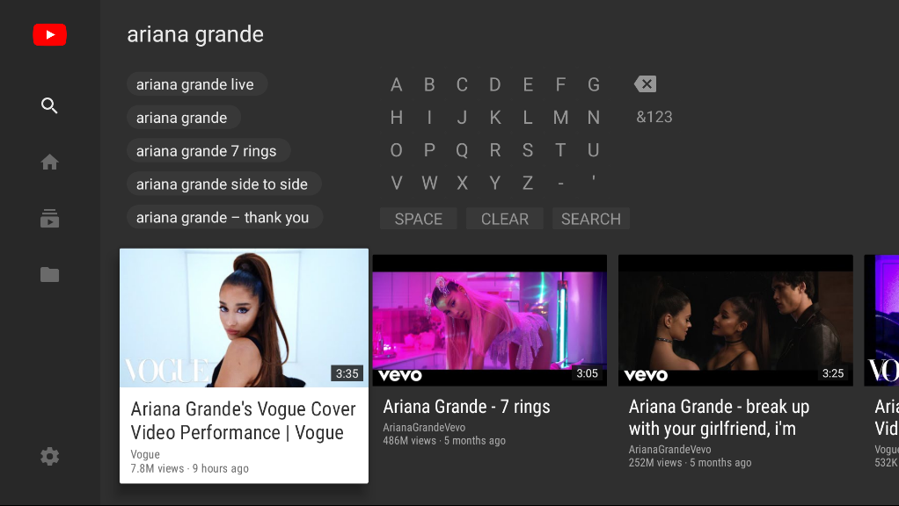
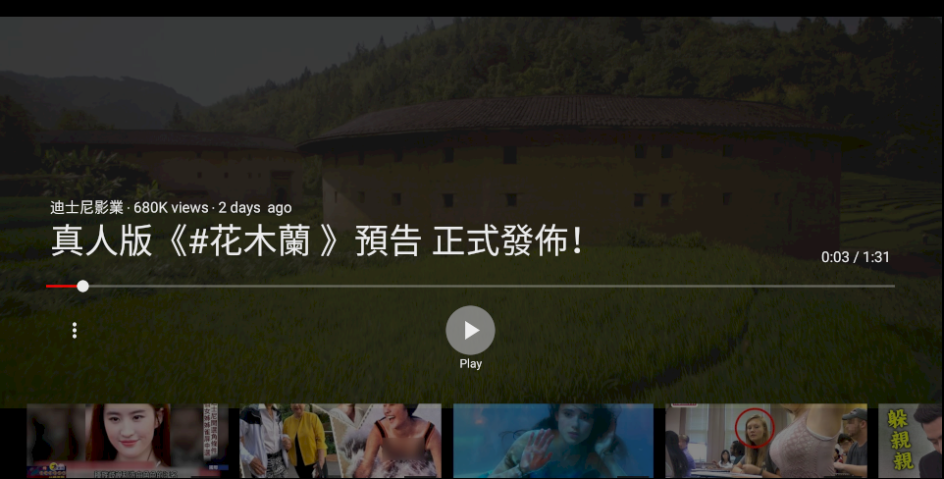
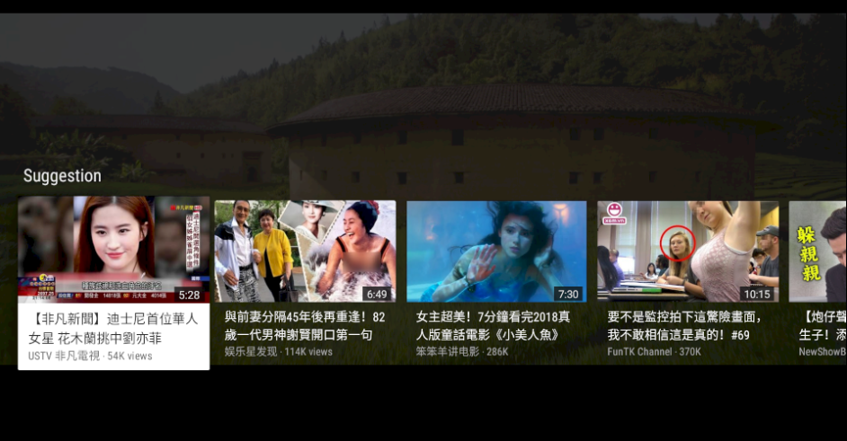
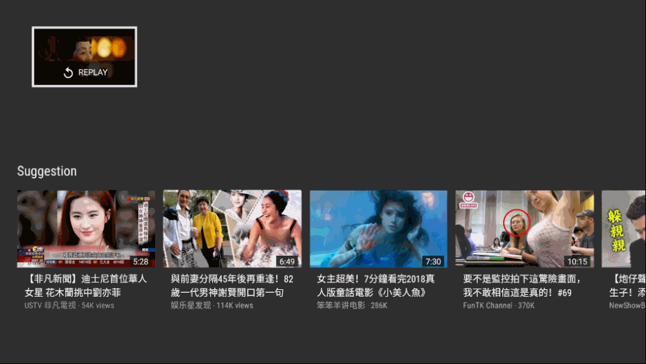

# YouTube Player

This TV App develops with [Leanback][leanback] library and [YouTube API][youtube]. I just put some videos in it and it can't remember the user's history data.

## Explore

- Home
  - Recommended
  - Latest
  - Music
  - Entertainment
  - Gaming
- Search
  - Google Search Tool
  - TV Keyboard
- Play
  - Playback Control
  - Post Play

## Screenshots

[Home][youtubefragment]

[Search][searchfragment]

[Player][playerfragment]

[youtubefragment]: ./app/src/main/java/jacklin/com/youtubefxc/ui/youtube/YoutubeFragment.java

[searchfragment]: ./app/src/main/java/jacklin/com/youtubefxc/ui/search/SearchFragment.java

[playerfragment]: ./app/src/main/java/jacklin/com/youtubefxc/ui/player/PlayerControlsFragment.java

[leanback]: https://github.com/googlesamples/androidtv-Leanback
[youtube]: https://developers.google.com/youtube/v3/getting-started
